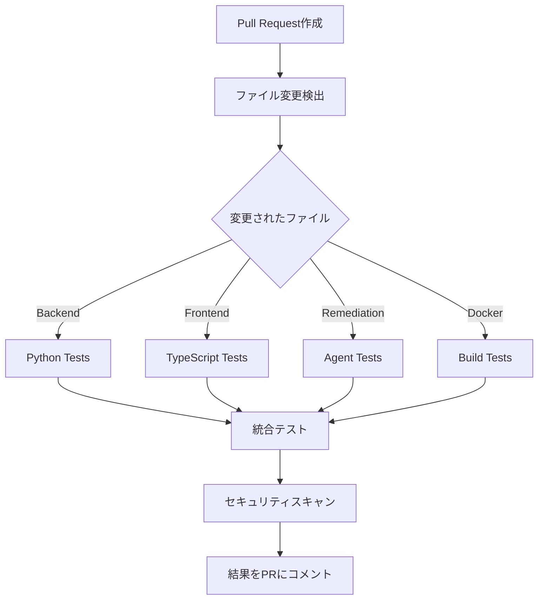

# 🚀 CI/CD パイプライン設定ガイド

## 📋 概要

このプロジェクトでは、GitHub ActionsベースのCI/CDパイプラインを使用して、Pull Request時に自動的にunit testが実行される仕組みを構築しています。

## 🎯 主要機能

### 1. **インテリジェントなファイル変更検出**
- 変更されたファイルに応じて、必要なテストのみを実行
- 無駄なリソース使用を避けて高速なフィードバックを実現

### 2. **コンポーネント別テスト**
| コンポーネント | トリガー | テスト内容 |
|---------------|----------|-----------|
| **Backend** | `backend/**`, `requirements.txt` | Python単体テスト、lint、カバレッジ |
| **Frontend** | `frontend/**`, `package.json` | TypeScript型チェック、lint、単体テスト |
| **改修エージェント** | `remediation/**` | エージェント初期化、統合テスト |
| **Docker** | `docker/**`, `docker-compose.yml` | ビルドテスト、設定検証 |

### 3. **自動テスト実行フロー**



## 🔧 設定されたワークフロー

### `.github/workflows/ci.yml`
**メインのCI/CDパイプライン**

#### **Jobs構成:**
1. **detect-changes**: 変更ファイル検出
2. **test-backend**: Pythonバックエンドテスト
3. **test-remediation**: 改修エージェントテスト
4. **test-frontend**: React/TypeScriptテスト
5. **test-docker**: Dockerビルドテスト
6. **integration-test**: 統合テスト
7. **security-scan**: セキュリティスキャン
8. **test-summary**: 結果サマリー

#### **実行条件:**
- Pull Request作成時
- `main`, `develop`ブランチへのpush時

### `.github/workflows/pr-comment.yml`
**テスト結果のPRコメント自動投稿**

#### **機能:**
- テスト結果をPRに自動コメント
- 成功/失敗のステータス表示
- 詳細ログへのリンク提供

## 📊 テスト設定詳細

### **Backend Tests**
```bash
# 実行コマンド例
cd backend
python -m pytest tests/ -v --cov=app --cov-report=xml
```

**含まれるテスト:**
- 単体テスト（サービス、API、モデル）
- 統合テスト（データベース連携）
- 改修エージェント初期化テスト
- カバレッジ80%以上必須

### **Frontend Tests**
```bash
# 実行コマンド例
cd frontend
npm run test:run
npm run type-check
```

**含まれるテスト:**
- コンポーネント単体テスト（Vitest + React Testing Library）
- TypeScript型チェック
- ESLintによるコード品質チェック

### **改修エージェントTests**
```bash
# 実行コマンド例
python -m pytest tests/test_remediation/ -v
```

**含まれるテスト:**
- エージェント初期化テスト
- サービス統合テスト
- 改修ワークフローテスト

## 🚀 使用方法

### **1. Pull Request作成**
```bash
git checkout -b feature/new-feature
# コード変更
git add .
git commit -m "feat: add new feature"
git push origin feature/new-feature
# GitHubでPR作成
```

### **2. 自動テスト実行**
- PR作成と同時にCI/CDパイプライン開始
- 変更ファイルに応じて必要なテストのみ実行
- 結果がPRに自動コメント

### **3. 結果確認**
**PRコメント例:**
```
## ✅ Automated Test Results

**Status**: Tests passed
**Workflow**: CI/CD Pipeline
**Commit**: abc1234

### 📊 Test Summary
- **Backend Tests**: ✅ Passed
- **Frontend Tests**: ✅ Passed
- **Integration Tests**: ✅ Passed
- **Security Scan**: ✅ Passed
```

## 🔍 ローカルテスト実行

### **Backend**
```bash
cd backend
source ../.venv/bin/activate
python -m pytest tests/ -v
```

### **Frontend**
```bash
cd frontend
npm install
npm run test
```

### **改修エージェント**
```bash
export PYTHONPATH="${PYTHONPATH}:$(pwd):$(pwd)/backend"
python -m pytest tests/test_remediation/ -v
```

### **Docker**
```bash
docker-compose config
docker-compose up -d --build
```

## 📈 カバレッジレポート

### **Backend Coverage**
- 最小カバレッジ: 80%
- HTML レポート: `backend/htmlcov/index.html`
- XML レポート: `backend/coverage.xml`

### **Frontend Coverage**
- Vitest カバレッジレポート
- HTML レポート: `frontend/coverage/index.html`

## 🔒 セキュリティスキャン

### **Python (Bandit)**
```bash
bandit -r backend/app/ remediation/ -f json
```

### **依存関係チェック**
- Dependabot による自動依存関係更新
- セキュリティ脆弱性の自動検出

## 🛠️ カスタマイズ

### **新しいテストカテゴリ追加**
1. `.github/workflows/ci.yml`の`detect-changes`に新しいパスフィルターを追加
2. 対応するジョブを追加
3. テストスクリプトを実装

### **テスト条件変更**
- `backend/pytest.ini`: Python テスト設定
- `frontend/vitest.config.ts`: Frontend テスト設定
- `.github/workflows/ci.yml`: CI/CD設定

## 🚨 トラブルシューティング

### **テスト失敗時**
1. **ログ確認**: GitHub Actions の詳細ログを確認
2. **ローカル実行**: 同じテストをローカルで実行
3. **依存関係**: requirements.txt, package.jsonの更新確認

### **よくある問題**
- **環境変数不足**: テスト用環境変数の設定確認
- **依存関係エラー**: pip/npm install の実行
- **パス問題**: PYTHONPATH の設定確認

## 📚 参考資料

- [GitHub Actions Documentation](https://docs.github.com/en/actions)
- [pytest Documentation](https://docs.pytest.org/)
- [Vitest Documentation](https://vitest.dev/)
- [Docker Compose Documentation](https://docs.docker.com/compose/)

---

**🎯 結果**: Pull Request作成時に、修正されたファイルに応じて自動的にunit testが実行される仕組みが完成しました！
